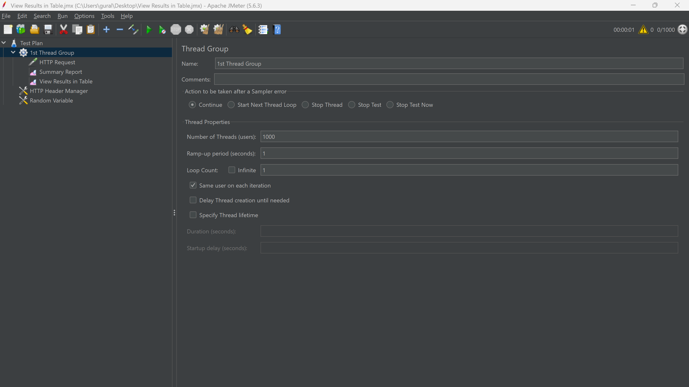
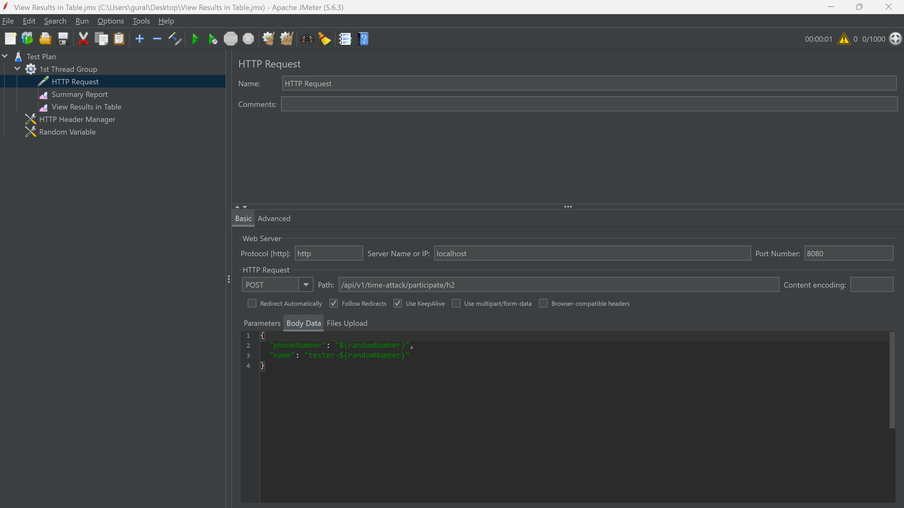
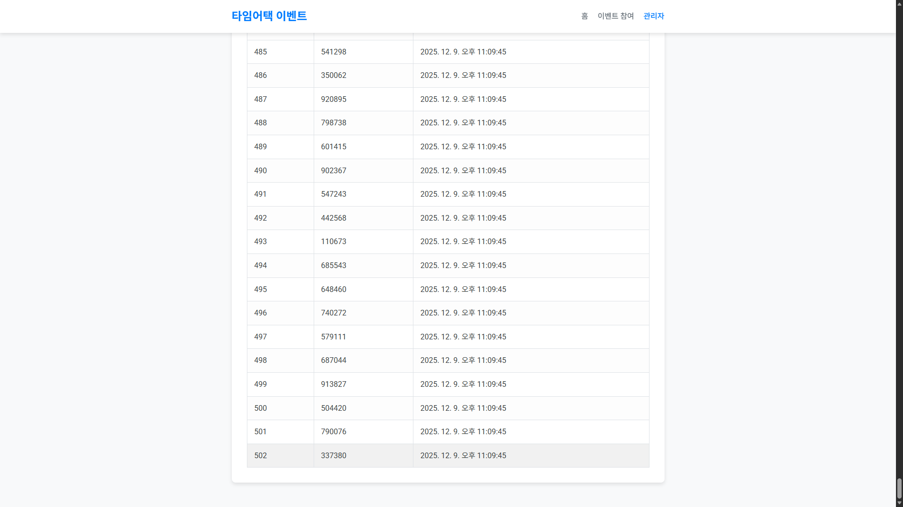
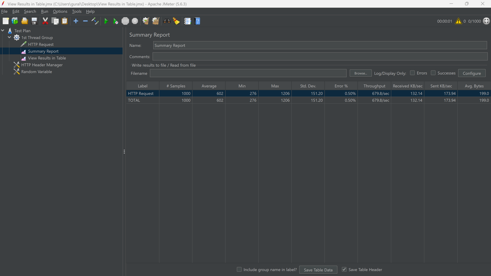
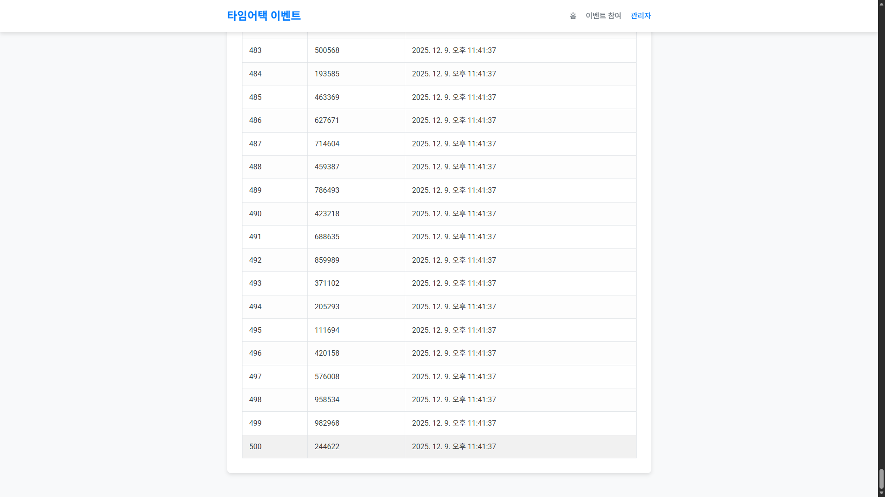
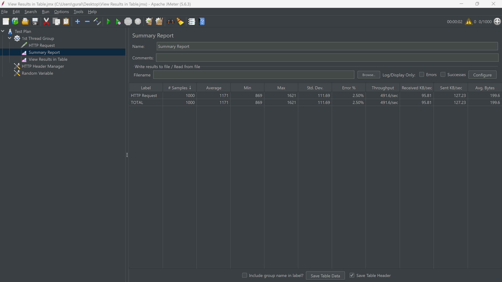

## JMeter Report

---
> 테스트 환경
> 
> JMeter 버전: apache-jmeter-5.6.3

- 1초 내에 1000명의 사용자가 동시에 접속하는 상황 가정

---

- ### `/api/v1/time-attack/participate/h2` 테스트

- ### `/api/v1/time-attack/participate/redis` 테스트

---

테스트의 목적: 성능 측정 및 동시성 제어 검증

확인 결과

1.
    - h2 = 502명(2명초과)
    - redis = 500명(정상)
    - service내의 h2 동시성 제어 문제로 인한 초과 당첨 발생

2.
    - H2 Throughput:  679.8/sec
    - Redis Throughput:  491.6/se
    - 기대와 달리 Redis가 더 낮은 처리량을 보임 -> 이유는 service내의 redis 처리에서 동기적 DB저장 등 로직 처리 시간 때문으로 추정